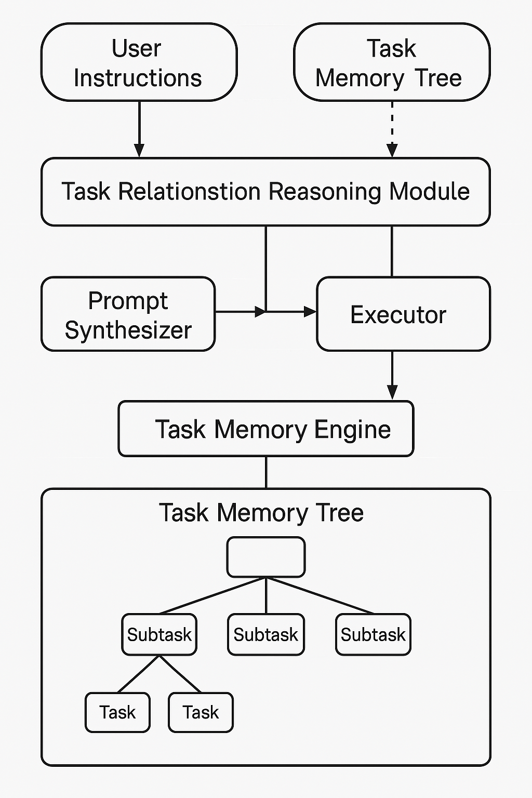

This project is real and under active development. The current repository contains an early rough version of the structured scaffold and mock examples to demonstrate the architecture.
✅ We are gradually committing full implementations before June 7, 2025.
Thank you for your patience — feel free to star, watch, or follow the repo for updates!

# 🧠 Task Memory Engine (TME)

**TME** is a structured memory engine designed for LLM-based agents to perform **multi-step task planning**, **rollback**, **dynamic preference adjustment**, and **task-to-task reasoning**.

> 📄 Paper: *Task Memory Engine (TME): A Structured Memory Framework with Graph-Aware Extensions for Multi-Step LLM Agent Tasks*  
> 🧑‍💻 GitHub: [@biubiutomato](https://github.com/biubiutomato)  
> 📦 Version: `v1.0` (core modules scaffolded)  
> 📘 License: [Polyform Noncommercial 1.0.0](https://polyformproject.org/licenses/noncommercial/1.0.0/)  
> 💼 Free for academic and personal use. For commercial use, please contact the author.


---

## 🚧 Project Status: Actively Developing

This is the **initial release of TME**, with core architecture scaffolded and mock examples included 🎉  
We are currently working on:

- 🔄 Implementing **DAG-based memory modeling** to support more flexible, non-linear task dependencies  
- 🧠 Enhancing the **reasoning and execution modules** with full LLM-based behavior

> 🔍 **Note:** Current modules contain placeholders and mock logic. The repository focuses on structural clarity and early prototype demonstration. Full implementations are coming soon.

📣 If you find this project helpful, please consider **starring**, **forking**, or **sharing** it!  
Citation info and `citation.bib` are provided below for academic use.

For feedback or collaboration, contact [biubiutomato@gmail.com](mailto:biubiutomato@gmail.com)

---

## 🏗️ System Architecture



---

## 🔧 Key Features

- ✅ **Task Memory Tree (TMT)** — hierarchical structured task tracking  
- 🔁 **Rollback & Re-routing** — replan from any subtask  
- 🧠 **Task Reasoning** — detect dependency / replacement / parallel branches  
- ✏️ **Prompt Synthesizer** — auto-generate subtasks from TMT  
- 🪢 **Execution Feedback Loop** — enable history-aware retry

---

## 📁 Repository Structure

```bash
tme-agent/
├── LICENSE
├── README.md
├── assets/
│   └── tme_architecture.png
├── tme/
│   ├── memory_tree.py         # TMT data structure & node management
│   ├── reasoning.py           # Placeholder for task dependency classifier
│   └── executor.py            # Placeholder for prompt generation & execution
└── examples/
    ├── trip_ChatGPT.py
    ├── trip_TEM.py
    ├── formfilling_ChatGPT.py
    └── formfilling_TEM.py
```

# TEM agent vs ChatGPT baseline
# example - form filling (temporarily mocked)
python examples/fillform_ChatGPT.py
python examples/fillform_TEM.py
more examples coming soon...

---

## 🚀 Quick Start

### 1. 📦 Install dependencies

```bash
pip install openai
pip install python-dotenv  # if using .env to manage keys (recommended)
```

### 2. 🔐 Set your API Key

```bash
export OPENAI_API_KEY=your_key_here
```

Or create a `.env` file:
```env
OPENAI_API_KEY=your_key_here
```

---

## 🧪 Examples

### ➤ Travel Planner (multi-step destination planning)
Coming soon...

### ➤ Form Filling (guided assistant with mocked LLM outputs)
```bash
python examples/formfilling_ChatGPT.py
python examples/formfilling_TEM.py
```

---

## 📄 License & Usage

This project is released under the **[Polyform Noncommercial License 1.0.0](https://polyformproject.org/licenses/noncommercial/1.0.0/)** — free for **academic and personal use only**.

> 💼 For commercial use, please contact the author directly for a license.  
> 📧 Contact: biubiutomato@gmail.com

---
## 📚 Citation

If you find this project useful in your research, please consider citing our arXiv paper:

```bash
@misc{ye2025taskmemoryenginetme,
  title     = {Task Memory Engine (TME): A Structured Memory Framework with Graph-Aware Extensions for Multi-Step LLM Agent Tasks},
  author    = {Ye Ye},
  year      = {2025},
  eprint    = {2504.08525},
  archivePrefix = {arXiv},
  primaryClass  = {cs.AI},
  url       = {https://arxiv.org/abs/2504.08525}
}
```


