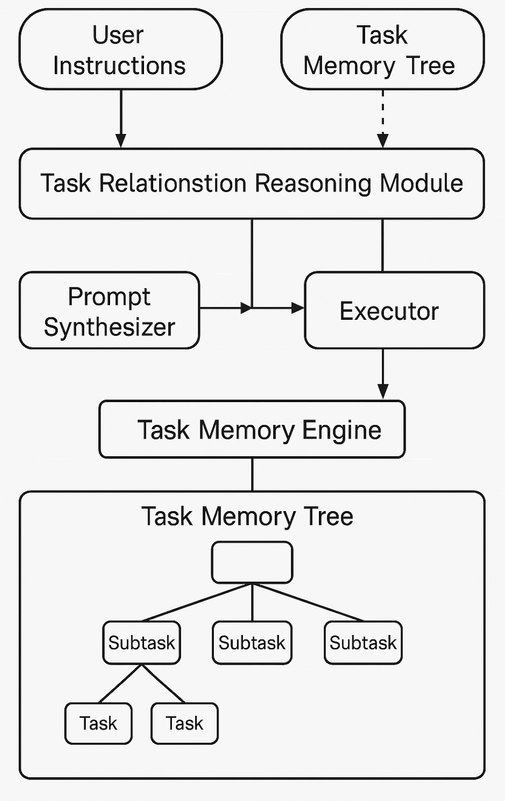
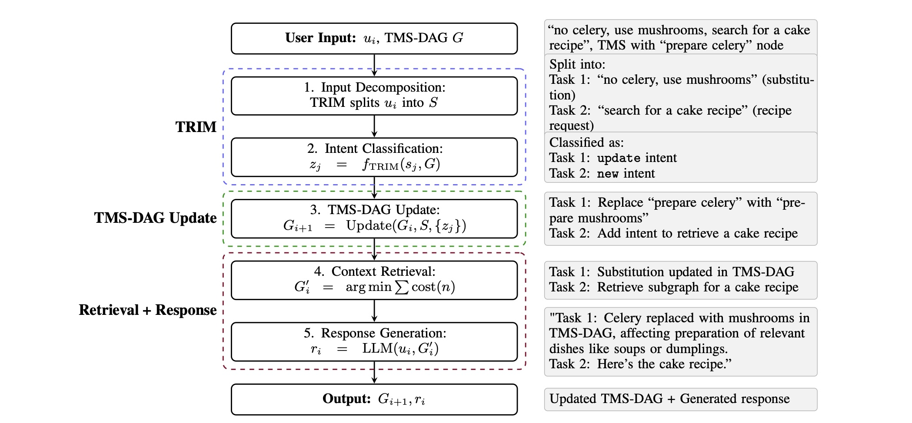

# 🧠 Task Memory Engine (TME)

**Task Memory Engine (TME)** is a structured memory framework for LLM-based agents, enabling **multi-step task planning**, **rollback**, **replacement**, and **graph-based reasoning**.

---

## 📄 About This Repository

This repository contains prototype code for two research versions of TME:

- **v1**: Tree + graph memory framework with slot-based task tracking  
  ↪︎ Paper: [*Task Memory Engine (TME): A Structured Memory Framework with Graph-Aware Extensions for Multi-Step LLM Agent Tasks*](https://arxiv.org/abs/2504.08525)

- **v2**: Spatial memory system with rollback, replacement, DAG dependencies, and memory-aware QA  
  ↪︎ Paper: [*Task Memory Engine: Spatial Memory for Robust Multi-Step LLM Agents*](https://arxiv.org/abs/2505.19436)

> ⚠️ **Disclaimer**: This is a reference implementation aligned with the above papers. v1 and v2 are conceptually related but structurally distinct. The repository is under active development, and modules may change before final release. As of June 08, 2025, full implementations are in progress.

---

## 🚀 Quick Start

### 1. Install Dependencies

```bash
pip install openai
pip install python-dotenv  # if using .env to manage openai keys (recommended)
```

### 2. Set Your OPENAI API Key

```bash
export OPENAI_API_KEY=your_key_here
```

Or use a `.env` file:

```env
OPENAI_API_KEY=your_key_here
```

### 3. Run Example Cases

Test cases are `.json` files in the `cases/` directory, each containing a sequence of user instructions.
Test cases are running on ChatGPT-4o model.

| Case                  | File                          | Description                          | Mode      |
|-----------------------|-------------------------------|--------------------------------------|-----------|
| ✈️ Travel Planning   | `cases/travel_planning_case.json` | Multi-step travel booking       | `general` |
| 🧑‍🍳 Cooking Planner  | `cases/cooking_case.json`     | Recipe steps, edits, substitutions  | `general` |
| 📅 Meeting Scheduling | `cases/meeting_scheduling_case.json` | Rescheduling multi-user meetings | `general` |
| 🛒 Cart Editing       | `cases/cart_editing_case.json` | Add/remove items, undo operations   | `cart`    |


**Run Commands**:

```bash
# Run with default classifier (general)
python run_case.py cases/trip_planning_case.json
python run_case.py cases/cooking_case.json
python run_case.py cases/meeting_scheduling_case.json

# Run cart case with specialized intent_classifier
python run_case.py cases/cart_editing_case.json --mode cart
```

---

## 🧠 Key Features

- **Task Memory Tree (TMT)**: Hierarchical, structured task memory
- **Rollback / Replace**: Update or revert previous decisions
- **Graph Reasoning (DAG)**: Non-linear dependencies between subtasks
- **Instruction Decomposer**: LLM-based substep splitting
- **TRIM (Task Relation Inference Module)**: Classify task relations (merge, depend, rollback, etc.)
- **Memory-Aware QA**: Answer queries like “what’s currently in memory?”

---

## 🏗️ System Architecture

TME processes user inputs into a structured graph of subtasks, preserving history, dependencies, and intent transitions. Below are the architectural diagrams for v1 and v2:

- **TME v1 Architecture**: Illustrates the tree + graph memory framework with slot-based task tracking.  
  

- **TME v2 Architecture**: Depicts the structured memory system with DAG dependencies and memory-aware QA.  
  
  

### Directory Structure

```
TME-Agent/
├── run_case.py                         # Main script to execute test cases
├── cases/                              # JSON input files for test scenarios
├── assets/                             # Architecture diagrams
├── v2/
│   ├── TaskMemoryStructure.py          # TaskNode & TaskMemoryTree logic
│   ├── input_splitter.py               # LLM-based instruction decomposition
│   ├── trim.py                         # Task relation reasoning (TRIM)
│   ├── intent_classifier_general.py    # General classifier (default)
│   └── intent_classifier_specific/
│       └── intent_classifier_cart.py   # Cart-specific classifier
├── citation.bib
└── README.md
```

---

## 📚 Citation

If you find this project useful, please consider citing:

**v2**:
```bibtex
@misc{ye2025taskmemoryenginespatial,
  title     = {Task Memory Engine: Spatial Memory for Robust Multi-Step LLM Agents},
  author    = {Ye Ye},
  year      = {2025},
  eprint    = {2505.19436},
  archivePrefix = {arXiv},
  primaryClass  = {cs.AI},
  url       = {https://arxiv.org/abs/2505.19436}
}
```

**v1**:
```bibtex
@misc{ye2025taskmemoryenginetme,
  title     = {Task Memory Engine (TME): A Structured Memory Framework with Graph-Aware Extensions for Multi-Step LLM Agent Tasks},
  author    = {Ye Ye},
  year      = {2025},
  eprint    = {2504.08525},
  archivePrefix = {arXiv},
  primaryClass  = {cs.AI},
  url       = {https://arxiv.org/abs/2504.08525}
}
```

---

## 🛡️ License & Usage

This project is licensed under the **Polyform Noncommercial License 1.0.0**.  
- Free for academic and personal use.  
- For commercial use, please contact the author directly for a license. 📧 Contact: biubiutomato@gmail.com

---

## 🌟 Star, Cite, Collaborate

If this project inspires or assists you, please consider:

- ⭐ Starring the repository
- 🧵 Opening discussions or issues
- 📚 Citing the relevant paper(s)

Let’s build memory-aware LLM agents together!